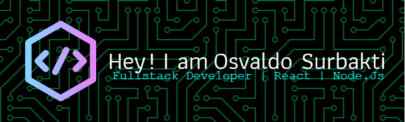

A passionate Fullstack Developer based in Indonesia 🇮🇩, with a strong background in web and mobile development. Skilled in JavaScript, React, Node.js, and PHP with a passion for building intuitive and scalable digital experiences.

---

## 🛠 Tech Stack

**Languages & Frameworks:**

**Frontend:**

**Backend & DB:**

**Other Tools:**

---

## 📬 Connect With Me

---

## 📈 GitHub Stats

---

> “Code is like humor. When you have to explain it, it’s bad.” – Cory House
